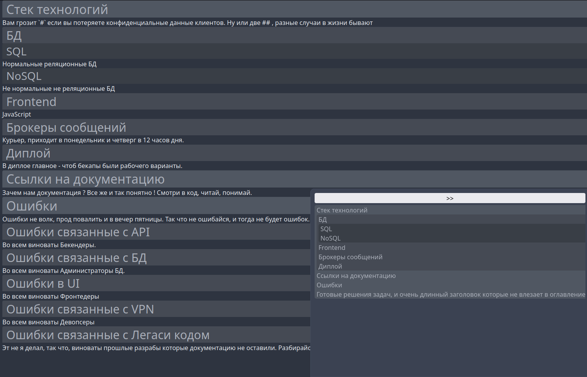
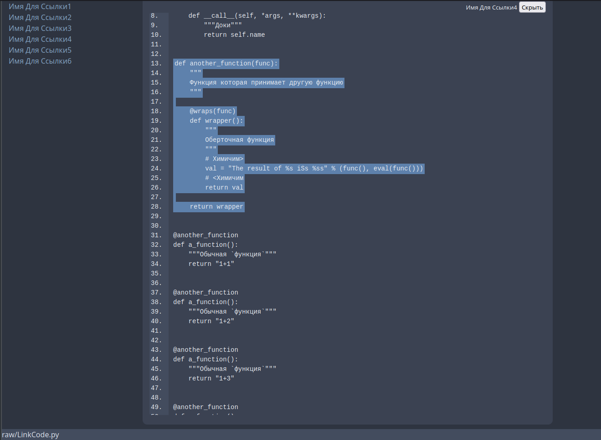
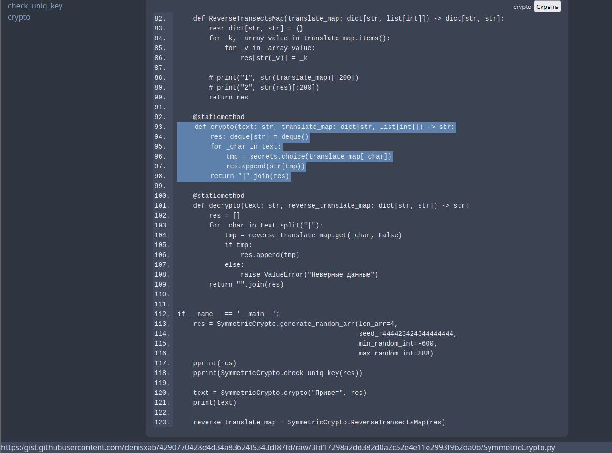
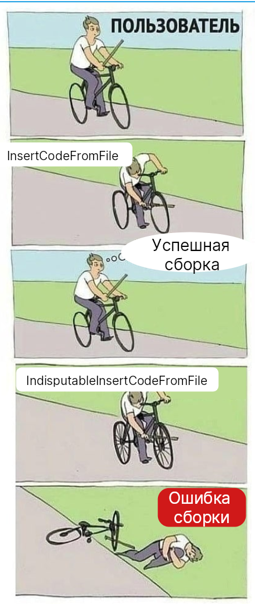
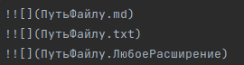
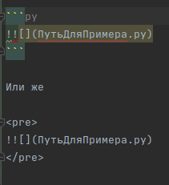

# Причина появления

%%%%

`Markdown` хорош, опрятен, и не многословен, он как сын маминой подруги, среди
всех остальных языков разметки. В нашем кругу `Markdown` заслужил уважение тем
что он использует спец символы для разметки, а не этот ваш заморский говор. Так
как `Markdown` хорош, и существует достойные редакторы для него, мы решили не
создавать очередной велосипед, а создать из существующего - электро байк по
имени `MarkdownDRY`
. [Ссылка на репозиторий](https://github.com/denisxab/MarkdownDRY)


---
Немного искренности от автора: Это документация написана в юмористическом стили,
чисто, для того чтобы поднять настроения свои товарищам по клавиатуре.
Кого-нибудь конечно будет серьезная документация, и стабильные ветки, и об этом
событии, первыми, вы сможете узнать в группе `MDDRY`, там же вы можете накидать
багов связанные с `MDDRY`, вмести свои предложения для новых `ФИЧ`. Если вы
хотите выразить свое неудержимое негативное мнение, то можете это сделать
группу `НЕ_ЛЮБЛЮ_MDDRY`.

---

Про лицензию: `MarkdownDRY` не имеет ни какой лицензии, и не имеет авторского
права, юзайти его в своё удовольствие, и если хотите, делитесь впечатлениями ;)


# Какие фичи предлагает MarkdownDRY ?

Начнем с того что `MarkdownDRY` как раз имеет такое название, из-за того что
следует принципу разработки
`Don’t repeat yourself (DRY; с англ «не повторяйся»)` и все его фичи направлены
во имя этого принципа.

Также, следовательно, из названия `MarkdownDRY` совместим с `Markdown` и эта
связь не только синтаксическая, но и ментальная. Он такой же простой, и с ним
справиться любая домохозяйка.

Вот изображение которые объясняет обратную совместимость.


## Список фич

### Переменные - `Vars`

Вот что думаю - авторы не любят повториться, а читатели любят когда им,
повторяют, и это безответная любовь сводиться к тому что документация похожа на
крысиную нору. Куски информации раскиданы по всему тексту, читатель забывает
важный аспект, совершает ошибку, ищет её решение по всему тексту, напрягает
извилины, ну а автор не хочет дублировать текст везде, где это нужно, и максимум
дает ссылку на главу в котором где-то написан этот важный аспект.

Все могло бы быть взаимно, если бы автор напомнил читателю важные аспекты,
везде, где это нужно, но не при это без ручного дублирование текста.

Надеюсь я доказал зачем нужны переменные в языке разметки ?


#### Синтаксис

Переменные в `MarkdownDRY` похожи на переменные в ЯП, у них есть

- Инициализации. (Похоже на список ссылок которые указывают на какие-то данные)

  <pre>
  - [=ИмяПеременной_1](Любой текст)
  - [=ИмяПеременной_2](Любой текст)
  - [=ИмяПеременной_N](Любой текст)
  </pre>

- Обращение. (Это просто красивый и не занятый шаблон)

  <pre>
  [=ИмяПеременной]
  </pre>

- Область видимости. Инициализациия переменных и обращения к ним, должно быть в
  одном файле и в каком-нибудь заголовке(
  если вам нужна переменная из другого файла, то подумайте, а может вам лучше
  объединить эти файлы, или же использовать `Ссылочные блоки`). Поиск переменных
  производиться при формировании кеша заголовков который создается при сборке
  файла.

  Алгоритм поиска - Начинаем искать все заголовки в файле, встречается нам
  заголовок, из него мы берем название, уровень, и весь текст от начало этого
  заголовка и до следующего. Весь текст заголовка парсим и ищем инициализацию
  переменных, если находим их то заносим в кеш текущего заголовка, после этого
  ищем обращения к переменным, если они есть то начинаем поиск сначала в текущем
  заголовке, потом в ранее инициализированных заголовков, но не во всех, а
  только в тех что, выше текущего.

  **В общем не парьтесь, глянете на примеры, попробуйте втянутся, и сразу
  поймете что к чему тут.**

- Переопределение. Тут все по классике, возьмется инициализированная переменная,
  которая ближе всего к месту обращения.

#### Пример

Нам нужно написать документацию для реляционной таблицы. Мы можем облегчить себе
работу, но не жизнь, используя переменные.

<pre>
!
</pre>

---

Итог:

> Обратим внимание, что обращение к не инициализированной переменной `[=IS_LONELY_DOG]` останется без изменений.


### Ссылочный блок - `ReferenceBlock`

Ссылочные блоки — они нужны, чтобы делать ссылки на блоки текста. Вы можете где
угодно инициализировать ссылочный блок, и где угодно получить его данные. Имена
ссылочных блоков должны быть уникальны, они похоже на теги в `Markdown` ,
например если вы будете использоваться редактор `Obsidian` то в нём есть
автокомплит и поиск по тегам, эту возможность можно также использовать для
ссылочных блоков.


#### Синтаксис

Инициализация:

<pre>
[#Имя-Ссылки-На_Блок]( 

Любой 
Многострочный текст
Может быть, тут. Только не забудет поставить два переноса строки до и после текста.

)
</pre>

---

Обращение:

<pre>
[#Имя-Ссылки-На_Блок]
</pre>

#### Пример

Так как `MarkdownDRY` должен быть настолько простым, чтобы с ним смогла
справиться любая домохозяйка, сделаем пример для домохозяйки.

Наша гипотетическая домохозяйка, решили переписать сою кулинарную книгу рецепты
в электронный вид, чтобы поделиться своими знаниями на форуме с другими
домохозяйками. Она решила выбрать язык разметки `MarkdownDRY`, и это был её
осознанный выбор. Она знала что в нем есть ссылочные блоки, и это было ключевым
моментом в её решение.

Она использовала их, для того чтобы напоминать другим домохозяйкам, которые
возможно еще не совсем опытны, на важные аспекты в кулинарии.

Вот пример как она их использовала.

<pre>
!
</pre>

---
<pre>
!
</pre>

### Раскрываемые блок - `DropdownBlock`

Ладно, из-за моих плоских шутейк большая часть аудитории уже ушла, а это значит
что ты, мой читатель, который дошел до этой строки, особенный! Не такой, как
все. Поэтому сделаю тебе подарок - буду писать только суть, без демагогии.

Цель `раскрываемого блока`, скрыть излишнюю подробность при просмотре документа.

Принцип работы `DropdownBlock`


#### Синтаксис

- Шаблон

<pre>
? Описание скрытого блока

Любой многострочный 
Текст

?
</pre>

#### Пример

<pre>
!
</pre>

---


### Выделение блоков - `HighlightBlock`

#### Синтаксис

- `!` Пример
- `!!` Информирование
- `!!!` Предупреждение

#### Пример

<pre>
!
</pre>

---


### Фото Галерея - `PhotoGallery`

Группировать фотки это круто. Килир-фича когда вам нужно показать
последовательность действий использования UI, через фото.

#### Синтаксис

Вот так все просто. Делаем список, даем ему имя, и в нем делаем под список со
ссылками на фото.

<pre>
- Заголовок для группы c фото
    1. 
    2. 
    N. 
</pre>

#### Пример

Перед нами стоит ответственная задача, нужно собрать галерею из негодных и
годных мемов.

Решить эту задачу мы можем так

<pre>
!
</pre>
---


### Математический размах - `MathSpan`

А это уже не шутки ... серьезно ! У пользователей `MarkdownDRY` всегда будет под
рукой `SymPy`.

А это значит, что юзеры могут прямо в документации - рассчитывать траекторию
движения космического аппарата по просторам вселено, с учетом гравитационных
маневров около массивных тел. Или же, считать потраченные минуту на задачи
заказчиков.


#### Синтаксис

<pre>
`=КультурноеМатематическоеВыражение`
</pre>

#### Пример

<pre>
!
</pre>


---

(Комбинируем с `Vars`):

<pre>
!
</pre>


---

### Скрытые заголовки - `HiddenHeaders`

Бывает нужно, создать заголовок, для того чтобы сослаться на него, и мы не хотим
чтобы он попадал в оглавление документа. Для этого есть `HiddenHeaders`


#### Синтаксис

<pre>
# ^ИмяЗаголовка1
## ^ИмяЗаголовка2
### ^ИмяЗаголовка3
#### ^ИмяЗаголовка4
##### ^ИмяЗаголовка5
###### ^ИмяЗаголовка6
</pre>

#### Пример

Вот типичная документация проекта, из неё нам нужно скрыть заголовки которые
подробно описывать ошибки. В оглавление они будут занимать много лишнего места,
а вот ссылаться на эти заголовки в других местах документации будет полезно.
Поэтому воспользуемся `HiddenHeaders`


<pre>
!
</pre>

---

В итоге:


### Ссылки на структурные элементы кода - LinkCode

Полноценна эта фича, пока доступна только для `Python`, но вы можете
использовать универсальный вариант такой как `УникальныйЯкорь` для любого
формата данных.

Суть заключается в том, что вы можете делать ссылки на элементы кода такие как:

- `Класс`
- `Класс.Метод`
- `Класс.Атрибут`
- `Функция`
- `Переменная`
- `УникальныйЯкорь` отдельная глава *

#### Синтаксис

<pre>
+[Имя Для Ссылки](ПутьКФайлу.py#Класс)
+[Имя Для Ссылки](ПутьКФайлу.py#Класс.метод)
+[Имя Для Ссылки](ПутьКФайлу.py#Класс.атрибут)
+[Имя Для Ссылки](ПутьКФайлу.py#Функция)
+[Имя Для Ссылки](ПутьКФайлу.py#Переменная)
</pre>

#### УникальныйЯкорь

Суть в том что мы заключаем нужны текст в "блок", а потом ссылаемся на него. Эта
фича доступна во всех форматах.

Ссылка на Уникальный Якорь

<pre>
+[Имя Для Ссылки](ПутьКФайлуЛюбой#УникальныйЯкорь)
</pre>

Создание якоря

<pre>
УникальноИмяЯкоря>

Любой 
Текст
Можно Вписать

<УникальноИмяЯкоря
</pre>

#### Пример ссылки на локальные файлы

Есть файл `main.py`, вот его исходник

```
!
```

---

Будем делать ссылки на все возможные варианты элементов кода:

<pre>
!
</pre>

---
В итоге:



#### Пример ссылки на файл из интернета

У нас есть файл на `GitGist` или на `GitHub`, или откуда угодно. И нам нужно
сделать ссылку на него. Это делается точно так же как и на локальный файл. В
этом случае исходный код будет загружен при сборке `MarkdownDRY`. Если вам нужно
обновить исходный код на актуальный вариант из интернета, то пересоберите
проект. Ссылки похожие, теперь место пути указываем `URL`.

---

Вот реальный пример, ссылаться мой код из `GitGist`:

<pre> 
!
</pre>

---
В итоге:



### Экранированная вставить кода из файла - InsertCodeFromFile

Суть в том что мы можем вставлять текст из другого файла, в
результирующий `HTML` файл. В отличие от `IndisputableInsertCodeFromFile`
в `Markdown` файл он вставиться. Он будет обработан по стандартной
логике `Markdown` - блока с кодом.


#### Синтаксис

Вставить исходный код из файла в `MarkdownDRY`:

<pre>


</pre>

#### Пример

Вот файл, который будем вставлять, назовем его `./raw/regex_mem.txt`

```text [Текст регулярки]
!
```

---

Пример использование

<pre>

</pre>

---

В итоге:


### Бесспорная вставить кода из файла - IndisputableInsertCodeFromFile

`Бесспорная вставка` подразумевает что текст из файла вставиться без всякого
форматирования в файл `md` который после будет обработан `MarkdownDRY`. Вообще
это самый первый этап конвертации, в нем мы можем просто соединять
разные `markdown` файлы в один, вставлять текст для примеров из других файлов, и
делать что нраву. Но помните что - "с большой силой, приходит большая
ответственность"

Эта фича уже используется в этой документации, для вставки примеров. Я думаю это
очень хорошо когда примеры из документации являются также и данными для
тестирования, если мы что-то поменяли в логике программы, то мы поправим и текст
тестов. А так как примеры берутся из тестовых данных, то они будут всегда
актуальны.

Вот в чем разница `InsertCodeFromFile` от `IndisputableInsertCodeFromFile` для
обычного пользователя, которые пытается вставить исходный без экранирования в
документацию.



#### Синтаксис

Вот таким образом вы можете вставить исходный код из указанного файл в вашу
документацию. Этим же способом вы можете реализовать импорт различных `Markdown`
файлов, так как `IndisputableInsertCodeFromFile` это самый первый этап
компиляции, то вставленные(импортирование) `Markdown` файлы будут обработаны
компилятором `MarkdownDRY`.


> `Расширение` - лучше не указывать бинарные файлы для вставки. Но если душа просит, то ограничений на это нет.


Но если вам нужно вставить исходный код, и при этом этот текст не должен быть
обработан(проигнорирован) компилятором, то заключите его вставку в тег `<pre>`.
Как раз этим способом я пользуюсь в этой документации, для приведения примеров
на `MarkdownDRY`.



#### Пример

Мы разработали скрипт для парсинга `env` файлов, вещь полезная, и важная,
поэтому давайте напишем к ней документацию. Самая лучшая документация, это там
где меньше написано и больше показано, так что давайте сразу приведем пример,
как скрипт работает.

<pre>
!
</pre>

---
В итоге:

<pre>
!
</pre>

---------------

### Многостраничные кодблоки - MultiPageCode

#### Синтаксис

<pre>
- Описание

  ```ИмяЯзыка [КраткоеИмяДляБлока_1]{ВыделитьСтроки} 
  
  ```

  ```ИмяЯзыка [КраткоеИмяДляБлока_N]{ВыделитьСтроки} 
  
  ```
</pre>

- `[КраткоеИмяДляБлока]`- Название блока с кодом

- `{ВыделитьСтроки}` - Выделение строк, можно указывать конкретные строки через
  запятую(`{Число_1,Число_2}`)  или указывать диапазонны через
  тире `{Число_1-Число_2}`. Эти два варианта можно
  комбинировать.`{Число_1-Число_2,Число_3-Число_4,Число_5,Число_6`

#### Пример

<pre>
!
</pre>

---
В итоге:


### Многострочные таблицы - `MultiLineTables`

В Многострочные таблицы можно писать

- Переносы строк
- Фото
- Блоки с кодом
- Ссылочные блоки

Что еще дозволено:

- Доступны агрегатные функции `avg(),sum()`для диапазона ячейка.
- Разрешено обращаться к данным указанных ячеек и производить с ними
  арифметику (с использованием `SymPy`). Я не понимаю в чем прикол использовать
  английский алфавит для столбцов, поэтому у нас будут все равны - числовые
  столбцы - числовые строки, и начало у них с единицы.


#### Синтаксис

Для того чтобы таблица стала многострочной нужно указать в следующем столбце 3
тире подряд `-`. И так нужно делать для каждого столбца.

Обращение к ячейкам:

<pre>
`~НомерСтолбца,НомерСтроки`
</pre>

Вызов агрегатной функции: поговорка, чтобы запомнить порядок аргументов (Слева
на право, Сверху вниз)

<pre>
`~sum(НомерСтолбца_Старт,НомерСтолбца_Конец,НомерСтроки_Старт,,НомерСтроки_Конец)`
</pre>

#### Пример

<pre>
!
</pre>

---
В итоге:


### Пока не реализовано

#### Выделения изображения

Нарисовать квадрат(`[#]`)  на изображение
<pre>
![Любое описание[#]1x2x3x4]
</pre>

- 1 = ВерхняяЛеваТочка
- 2 = ВерхняяПраваяТочка
- 3 = НижняяЛеваТочка
- 4 = НижняяПраваяТочка

Нарисовать много квадратов(`[#]`)  на изображении - нужно перечислить через
запятую
<pre>
![Любое описание[#]1x2x3x4,1x2x3x4, и.тд.]
</pre>

---

Нарисовать стрелку(`[^]`) на изображение
<pre>
![Любое описание[^]1x2x3x4]
</pre>

- 1 = ВерхняяЛеваТочка
- 2 = ВерхняяПраваяТочка
- 3 = НижняяЛеваТочка
- 4 = НижняяПраваяТочка

Нарисовать много стрелок(`[^]`)  на изображении - нужно перечислить через
запятую
<pre>
![Любое описание[^]1x2x3x4,1x2x3x4, и.тд.]
</pre>
---

Комбинируем, квадраты и стрелку.
<pre>
![Любое описание[#]1x2x3x4,1x2x3x4[^]1x2x3x4,1x2x3x4,1x2x3x4]
</pre>

#### Последовательность действий

Синтаксис:
<pre>
-1> Шаг  -2> Шаг -3> Шаг


</pre>

Если вам нужно вставить фото для наглядного описания действий то:

<pre>
-1> Шаг  -2> Шаг -3> Шаг

- 
- 
</pre>

---
<pre>
Поиск блоков последовательности действий
(-.*>(?:.\s*(?!-<))+.)

Поиск элементов последовательности действий
-(!\[.*]\((?P[^)]+)\))?>((?:.(?!-(!\[.*]\([^)]+\))?>))+)
-> Базовый Модуль
 -> Справочники
 ->  Системные справочники
 ->  Системные справочники
 -> Классификаторы -> адресов/Территориальный участкиs 
 -> Классификаторы -> адресов/Территориальный участкиs
<div class="PP">
    {f'<div>{x.name}\n<div class="HidImg"><src url="{x.path}"/></div></div>' for x in PP }
</div>

</pre>
---

#### Описание UI виджетов

Для нестандартных оформлений нужно использовать html теги, по
типу `dry_ИмяПлагины`. В данном случае `dry_ui`.

Синтаксис

<pre>
  <dry_ui>
  -
    1. Описание виджета и выделение в квадрат [#]1x2x3x4,1x2x3x4
    2. Описание виджета и указание стрелочкой [^]1x2x3x4,1x2x3x4
    3. Описание виджета и выделение в квадрат и указание стрелочкой [#]1x2x3x4,1x2x3x4[^]1x2x3x4,1x2x3x4
  </dry_ui>
</pre>

