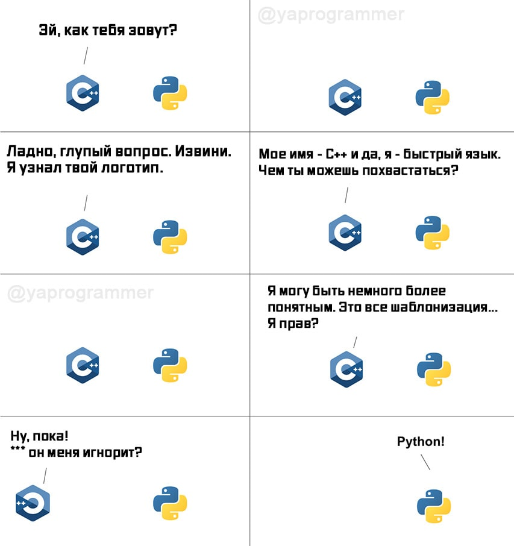

# Причина появления

`Markdown` хорош, опрятен, и не многословен, он как сын маминой подруги, среди
всех остальных языков разметки. В нашем кругу `Markdown` заслужил уважение тем
что он использует спец символы для разметки, а не этот ваш заморский говор. Так
как `Markdown` хорош, и существует достойные редакторы для него, мы решили не
создавать очередной велосипед, а создать из существующего - электро байк по
имени `MarkdownDRY`.


# Какие фичи предлагает MarkdownDRY ?

Начнем с того что `MarkdownDRY` как раз имеет такое название, из-за того что
следует принципу разработки
`Don’t repeat yourself (DRY; с англ «не повторяйся»)` и все его фичи направлены
во имя этого принципа.

Также, следовательно, из названия `MarkdownDRY` совместим с `Markdown` и эта
связь не только синтаксическая, но и ментальная. Он такой же простой, и с ним
справиться любая домохозяйка.

Вот мем которые объясняет обратную совместимость.


## Список фич

### Переменные - `Vars`

Эх ребята, можно было бы остановиться только на этой фичи, потому что она
фундаментальна.

Я вот что думаю - авторы не любят повториться, а читатели любят когда им,
повторяют, и это безответная любовь сводиться к тому что документация похожа на
крысиную нору. Куски информации раскиданы по всему тексту, читатель забывает
важный аспект, совершает ошибку, ищет её решение по всему тексту, напрягает
извилины, ну а автор не хочет дублировать текст везде, где это нужно, и максимум
дает ссылку на главу в котором где-то написан этот важный аспект.

Все могло бы быть взаимно, если бы автор напомнил читателю важные аспекты,
везде, где это нужно, но не при это без ручного дублирование текста.

Надеюсь я доказал зачем нужны переменные в языке разметки ?

#### Синтаксис

Переменные в `MarkdownDRY` похожи на переменные в ЯП, у них есть

- Инициализации. (Похоже на список ссылок которые указывают на какие-то данные)

    <pre>
    - [=ИмяПеременной_1](Любой текст)
    - [=ИмяПеременной_2](Любой текст)
    - [=ИмяПеременной_N](Любой текст)
    </pre>

- Обращение. (Это просто красивый и не занятый шаблон)

    <pre>
    [=ИмяПеременной]
    </pre>

- Область видимости. Инициализациия переменных и обращения к ним, должно быть в
  одном файле и в каком-нибудь заголовке(
  если вам нужна переменная из другого файла, то подумайте, а может вам лучше
  объединить эти файлы, или же использовать `Ссылочные блоки`). Поиск переменных
  производиться при формировании кеша заголовков который создается при сборке
  файла.

  Алгоритм поиска - Начинаем искать все заголовки в файле, встречается нам
  заголовок, из него мы берем название, уровень, и весь текст от начало этого
  заголовка и до следующего. Весь текст заголовка парсим и ищем инициализацию
  переменных, если находим их то заносим в кеш текущего заголовка, после этого
  ищем обращения к переменным, если они есть то начинаем поиск сначала в текущем
  заголовке, потом в ранее инициализированных заголовков, но не во всех, а
  только в тех что, выше текущего.

  **В общем пацаны не парьтесь, глянете на примеры, попробуйте втянутся, и сразу
  поймете что к чему тут.**

- Переопределение. Тут все по классике, возьмется инициализированная переменная,
  которая ближе всего к месту обращения.

#### Пример

Нам нужно написать документацию для реляционной таблицы. Мы можем облегчить себе
работу, но не жизнь, используя переменные.

Инициализируем переменные в которых будут храниться текст с типами(текста с
инициализацией переменных в html не будет, потому что зачем всем что вы любите
обзывать переменные тремя буквами XD)

- [=Строка255](тип varchar(255))
- [=Строка8](тип varchar(255))
- [=ЭтоОбязательно]((\* это поле обязательно для заполнения))
- [=ПоУмолчанию](По умолчанию)

Вот наша оригинальная таблица которая нуждается в документации. Приведем два
варианта как это можно записать.

- DLL_Имя Описание Тип
- Login Логин [=Строка255] [=ЭтоОбязательно]
- Password Пароль[=Строка255] [=ЭтоОбязательно]
- FIO ФИО [=Строка255]
- DATE_CREATE Дата рождения [=Строка8] [=ЭтоОбязательно]
- Family_Status Семейное положение [=ПоУмолчанию] [=IS_LONELY_DOG]

| DLL Имя       | Описание           | Тип                             |
| ------------- | ------------------ |---------------------------------|
| Login         | Логин              | [=Строка255] [=ЭтоОбязательно]  | 
| Password      | Пароль             | [=Строка255] [=ЭтоОбязательно]  |
| FIO           | ФИО                | [=Строка255] [=ЭтоОбязательно]  |
| DATE_CREATE   | Дата рождения      | [=Строка8]                      |
| Family_Status | Семейное положение | [=ПоУмолчанию] [=IS_LONELY_DOG] |

---

Итог:

> Обратим внимание, что обращение к не инициализированной переменной `[=IS_LONELY_DOG]` останется без изменений.

<pre>
- DLL_Имя Описание Тип
- Login Логин тип varchar(255) (\* это поле обязательно для заполнения)
- Password Парольтип varchar(255) (\* это поле обязательно для заполнения)
- FIO ФИО тип varchar(255)
- DATE_CREATE Дата рождения тип varchar(255) (\* это поле обязательно для заполнения)
- Family_Status Семейное положение По умолчанию [=IS_LONELY_DOG]

| DLL Имя       | Описание           | Тип                             |
| ------------- | ------------------ |---------------------------------|
| Login         | Логин              | тип varchar(255) (\* это поле обязательно для заполнения)  | 
| Password      | Пароль             | тип varchar(255) (\* это поле обязательно для заполнения)  |
| FIO           | ФИО                | тип varchar(255) (\* это поле обязательно для заполнения)  |
| DATE_CREATE   | Дата рождения      | тип varchar(255)                      |
| Family_Status | Семейное положение | По умолчанию [=IS_LONELY_DOG] |
</pre>

### Ссылочный блок - `ReferenceBlock`

Ссылочные блоки — они нужны, чтобы делать ссылки на блоки текста. Вы можете где
угодно инициализировать ссылочный блок, и где угодно получить его данные. Имена
ссылочных блоков должны быть уникальны, они похоже на теги в `Markdown` ,
например если вы будете использоваться редактор `Obsidian` то в нём есть
автокомплит и поиск по тегам, эту возможность можно также использовать для
ссылочных блоков.

#### Синтаксис

Инициализация

<pre>
[#Имя-Ссылки-На_Блок]( 

Любой 
Многострочный текст
Может быть, тут. Только не забудет поставить два переноса строки до и после текста.

)
</pre>

Обращение

<pre>
[#Имя-Ссылки-На_Блок]
</pre>

После сборки в месте обращения будет

<pre>
Любой 
Многострочный текст
Может быть, тут. Только не забудет поставить два переноса строки до и после текста.
</pre>

#### Пример

Наша гипотетическая домохозяйка, решили переписать сою кулинарную книгу рецепты
в электронный вид, чтобы поделиться своими знаниями на форуме с другими
домохозяйками. Она решила выбрать язык разметки `MarkdownDRY`, и был осознанный
выбор. Она знала что в нем есть ссылочные блоки, и это было ключевым моментом в
её решение.

Она использовала их, для того чтобы напоминать другим домохозяйкам, которые
возможно еще не совсем опытны, на важные аспекты в кулинарии.

Вот пример как она их использовала.

<pre>
# Аспекты кулинарии

[#НеВКипяток](

Если класть в некипящую воду, они могут слипнуться.

)

# Рецепты

## Макароны

Макароны варятся в среднем 7–10 минут. Но лучше ориентироваться на время, указанное на упаковке. В любом случае следите, чтобы изделия не расползлись. Если
хотите довести макароны до состояния al dente (сделать их слегка недоваренными), вычитайте пару минут из указанной цифры. Но только если на пачке сразу не
написано, что это время, необходимое для al dente. Как варить макароны на плите. Налейте в просторную кастрюлю воду. На 100 г макарон рекомендуют брать 1 л
воды, но можно использовать и поменьше. Главное — чтобы изделия свободно плавали в жидкости. Всыпьте соль. На такое количество воды хватит 1 чайной ложки с
горкой. Хотя в этом вопросе лучше всегда полагаться на свой вкус. По желанию можно добавить и другие специи. Поставьте кастрюлю на сильный огонь и дождитесь,
когда вода закипит. После закиньте макароны.

[#НеВКипяток]

## Пельмени

- Кастрюля должна быть невысокой и широкой, чтобы пельменям в ней было не тесно.
+ Вода должна заполнять ее на три четверти или две трети (пельмени вытеснят часть воды наверх по закону Архимеда ровно в том объеме, который займут сами).
- Солят воду сразу после закипания, но до того, как опускать в нее пельмени.
- Чтобы пельмени не склеивались можно добавить в воду ложку растительного масла.
+ Чтобы пельмени не приклеились ко дну кастрюли, нужно провести по дну кастрюли шумовкой, особо прилипчивые пельмени отскочат от дна.
* Варят пельмени 8-12 минут (в зависимости от размеров пельменей: мелкие – меньше, а крупные, соответственно, дольше). После того, как они всплывут, огонь уменьшают, чтобы вода не бурлила, это может привести к тому, что пельмени распадутся. И варят еще 3-5 минут.
- Перед подачей на стол, необходимо выловить пельмени из воды шумовкой и уложить в кастрюльку, чтобы вода с них стекла и только потом, выкладывать на тарелки. Дополнительно можно поставить кастрюльку на маленький огонь, чтобы вода выпарилась. Делается это для того, чтобы тесто несколько подсохло и лучше впитывало соус, с которым их поедают.

[#НеВКипяток]
</pre>

---


### Раскрываемые блок - `DropdownBlock`

Ладно, из-за моих плоских шутейк большая часть аудитории уже ушла, а это значит
что ты, мой читатель, который дошел до этой строки, особенный! Не такой, как
все. Поэтому сделаю тебе подарок - буду писать только суть, без демагогии.

Цель `раскрываемого блока`, скрыть излишнюю подробность при просмотре документа.

#### Синтаксис

- Шаблон

<pre>
? Описание скрытого блока

Любой многострочный 
Текст

?
</pre>

#### Пример

Wi-Fi (Wireless Fidelity) — технология беспроводной локальной сети с
устройствами на основе стандартов IEEE 802.11.

? диапазонамы WiFi

Основными диапазонами Wi-Fi считаются 2.4 ГГц (2412 МГц-2472 МГц), 5 ГГц (
5160-5825 МГц) и 6 ГГц (5955-7115 МГц). Сигнал Wi-Fi может передаваться на
километры даже при низкой мощности передачи, но для приема Wi-Fi-сигнала с
обычного Wi-Fi-маршрутизатора на далеком расстоянии нужна антенна с высоким
коэффициентом усиления (например параболическая антенна или Wi-Fi-пушка).

?

? История WiFI

Wi-Fi был создан в 1997 году в лаборатории радиоастрономии CSIRO (Commonwealth
Scientific and Industrial Research Organization) в Канберре, Австралия[3].
Создателем беспроводного протокола обмена данными является инженер Джон
О’Салливан.

?

Любое оборудование, соответствующее стандарту IEEE 802.11, может быть
протестировано в Wi-Fi Alliance и получить соответствующий сертификат и право
нанесения логотипа Wi-Fi.


---


### Выделение блоков - `HighlightBlock`

#### Синтаксис

- `!` Пример
- `!!` Информирование
- `!!!` Предупреждение

#### Пример

<pre>
! Пример

текст ТЕкст Текст т еКстп

!


!! Информация

текст ТЕкст Текст теКст

!!


!!! Предупреждение

текст ТЕкст Тек ст теКст

!!!
</pre>

---


### Фото Галерея - `PhotoGallery`

Группировать фотки это круто. Килир-фича когда вам нужно показать
последовательность действий использования UI, через фото.

#### Синтаксис

Вот так все просто. Делаем список, даем ему имя, и в нем делаем под список со
ссылками на фото.

<pre>
- Заголовок для группы c фото
    1. 
    2. 
    3. 
</pre>

#### Пример

Перед нами стоит ответственная задача, нужно собрать галерею из негодных и
годных мемов.

Решить эту задачу мы можем так

<pre>

- Годные мемы по мнению наших коллег

    1. 
    2. 
    3. 
    4. 

- Баяны, вообще не смешно ...

    1. 
    2. 
    3. 
    4. 
</pre>
---


### Математический размах - `MathSpan`

А это уже не шутки ... серьезно ! У пользователей `MarkdownDRY` всегда будет под
рукой `SymPy`.

А это значит, что юзеры могут прямо в документации - рассчитывать траекторию
движения космического аппарата по просторам вселено, с учетом гравитационных
маневров около массивных тел. Или же, считать потраченные минуту на задачи
заказчиков, которые выносят вам мозг на очередной галере.

Будем на половину пусты и полны, поэтому сразу рассмотрим эти два варианта в
примере ниже. Ну а пока теория:

#### Синтаксис

<pre>
`=КультурноеМатематическоеВыражение`
</pre>

#### Пример

Сколько минут было потраченное на задачу.

<pre>
`=10+100+45+23`
</pre>

---


Узнать НДФЛ

<pre>

- [=ЗпВ-Месяц](11_000)
- [=НДФЛ](99)
- [=СтолькоТоКусковХлеба](2 куска)

В нашей компании достоянная заработная плата для начинающих IT специалистов, в размере `=[=ЗпВ-Месяц]-(([=ЗпВ-Месяц]/100)*[=НДФЛ])` копеек.
Для более опытных сотрудников, мы оплачиваемый половину горячего обед, и выдаем [=СтолькоТоКусковХлеба] хлеба на руки.

- [=СколькоЧасовОтработано](99)
- [=СколькоЗадачВыполнено](10)
- [=СколькоРазВыОпоздали](1)
- [=РандомноеЧисло](2)
- [=ПремияБезНДФЛ](([=СколькоЧасовОтработано]*[=СколькоЗадачВыполнено]/[=СколькоРазВыОпоздали])-[=РандомноеЧисло])
- [=ПремияС_НДФЛ]([=ПремияБезНДФЛ]-(([=ПремияБезНДФЛ]/100)*[=НДФЛ]))

За успешное выполнение своих должностных обязательств 
вам полагается премия, в размере `=[=ПремияБезНДФЛ]` дополнительных задач.
</pre>

---


### Скрытые заголовки - `HiddenHeaders`

Бывает нужно, создать заголовок, для того чтобы сослаться на него, и мы не хотим
чтобы он попадал в оглавление документа. Для этого есть `HiddenHeaders`

#### Синтаксис

<pre>
# ^ИмяЗаголовка1
## ^ИмяЗаголовка2
### ^ИмяЗаголовка3
#### ^ИмяЗаголовка4
##### ^ИмяЗаголовка5
###### ^ИмяЗаголовка6
</pre>

#### Пример

Вот вариант когда можно скрыть заголовки из оглавления.

Видов ошибок может быть много, и они будут занимать много места в оглавление,
поэтому скроем заголовки с видами ошибок, и оставим только заголовок `Ошибки`

<pre>
# Ссылки на документацию
# Ошибки
## ^Ошибки связанные с API
## ^Ошибки связанные с БД
## ^Ошибки связанные с Криворукости
## ^Ошибки связанные с VPN
# Готовые решения задач
</pre>

### Ссылки на структурные элементы кода - LinkCode

Полноценна эта фича, пока доступна только для `Python`, но вы можете
использовать универсальный вариант такой как `УникальныйЯкорь` для любого
формата данных.

Суть заключается в том, что вы можете делать ссылки на элементы кода такие как:

- `Класс`
- `Класс.Метод`
- `Класс.Атрибут`
- `Функция`
- `Переменная`
- `УникальныйЯкорь` отдельная глава *

#### Синтаксис

<pre>
[Имя Для Ссылки](ПутьКФайлу.py#Класс)
[Имя Для Ссылки](ПутьКФайлу.py#Класс.метод)
[Имя Для Ссылки](ПутьКФайлу.py#Класс.атрибут)
[Имя Для Ссылки](ПутьКФайлу.py#Функция)
[Имя Для Ссылки](ПутьКФайлу.py#Переменная)
</pre>

#### УникальныйЯкорь

Суть в том что мы заключаем нужны текст в "блок", а потом ссылаемся на него. Эта
фича доступна во всех форматах.

Ссылка на Уникальный Якорь

<pre>
[Имя Для Ссылки](ПутьКФайлуЛюбой#УникальныйЯкорь)
</pre>

Создание якоря

<pre>
УникальноИмяЯкоря>

Любой 
Текст
Можно Вписать

<УникальноИмяЯкоря
</pre>

#### Пример ссылки на локальные файлы

Есть файл `main.py`, вот его исходник

```

```

---

Будем делать ссылки на все возможные варианты элементов кода:

<pre>

</pre>

---
В итоге:


#### Пример ссылки на файл из интернета

У нас есть файл на `GitGist` или на `GitHub`, или откуда угодно. И нам нужно
сделать ссылку на него. Это делается точно так же как и на локальный файл. В
этом случае исходный код будет загружен при сборке `MarkdownDRY`. Если вам нужно
обновить исходный код на актуальный вариант из интернета, то пересоберите
проект. Ссылки похожие, теперь место пути указываем `URL`.

---

Вот реальный пример, ссылаться мой код из `GitGist`:

<pre> 

</pre>

---
В итоге:


### Вставить кода из файла - InsertCodeFromFile

#### Синтаксис

Вставить исходный код из файла в `MarkdownDRY`,

<pre>


</pre>

#### Пример

Вот файл, который будем вставлять, назовем его `./raw/regex_mem.txt`

```text

```

---

Пример использование

<pre>

</pre>

---

В итоге


### Пока не реализовано

#### Выделения изображения

Нарисовать квадрат(`[#]`)  на изображение
<pre>
![Любое описание[#]1x2x3x4]
</pre>

- 1 = ВерхняяЛеваТочка
- 2 = ВерхняяПраваяТочка
- 3 = НижняяЛеваТочка
- 4 = НижняяПраваяТочка

Нарисовать много квадратов(`[#]`)  на изображении - нужно перечислить через
запятую
<pre>
![Любое описание[#]1x2x3x4,1x2x3x4, и.тд.]
</pre>

---

Нарисовать стрелку(`[^]`) на изображение
<pre>
![Любое описание[^]1x2x3x4]
</pre>

- 1 = ВерхняяЛеваТочка
- 2 = ВерхняяПраваяТочка
- 3 = НижняяЛеваТочка
- 4 = НижняяПраваяТочка

Нарисовать много стрелок(`[^]`)  на изображении - нужно перечислить через
запятую
<pre>
![Любое описание[^]1x2x3x4,1x2x3x4, и.тд.]
</pre>
---

Комбинируем, квадраты и стрелку.
<pre>
![Любое описание[#]1x2x3x4,1x2x3x4[^]1x2x3x4,1x2x3x4,1x2x3x4]
</pre>

#### Последовательность действий

Синтаксис:
<pre>
-1> Шаг  -2> Шаг -3> Шаг


</pre>

Если вам нужно вставить фото для наглядного описания действий то:

<pre>
-1> Шаг  -2> Шаг -3> Шаг

- 
- 
</pre>

---
<pre>
Поиск блоков последовательности действий
(-.*>(?:.\s*(?!-<))+.)

Поиск элементов последовательности действий
-(!\[.*]\((?P[^)]+)\))?>((?:.(?!-(!\[.*]\([^)]+\))?>))+)
-> Базовый Модуль
 -> Справочники
 ->  Системные справочники
 ->  Системные справочники
 -> Классификаторы -> адресов/Территориальный участкиs 
 -> Классификаторы -> адресов/Территориальный участкиs
<div class="PP">
    {f'<div>{x.name}\n<div class="HidImg"><src url="{x.path}"/></div></div>' for x in PP }
</div>

</pre>
---

#### Описание UI виджетов

Синтаксис
<pre>
-
  1. Описание виджета и выделение в квадрат [#]1x2x3x4,1x2x3x4
  2. Описание виджета и указание стрелочкой [^]1x2x3x4,1x2x3x4
  3. Описание виджета и выделение в квадрат и указание стрелочкой [#]1x2x3x4,1x2x3x4[^]1x2x3x4,1x2x3x4
</pre>
